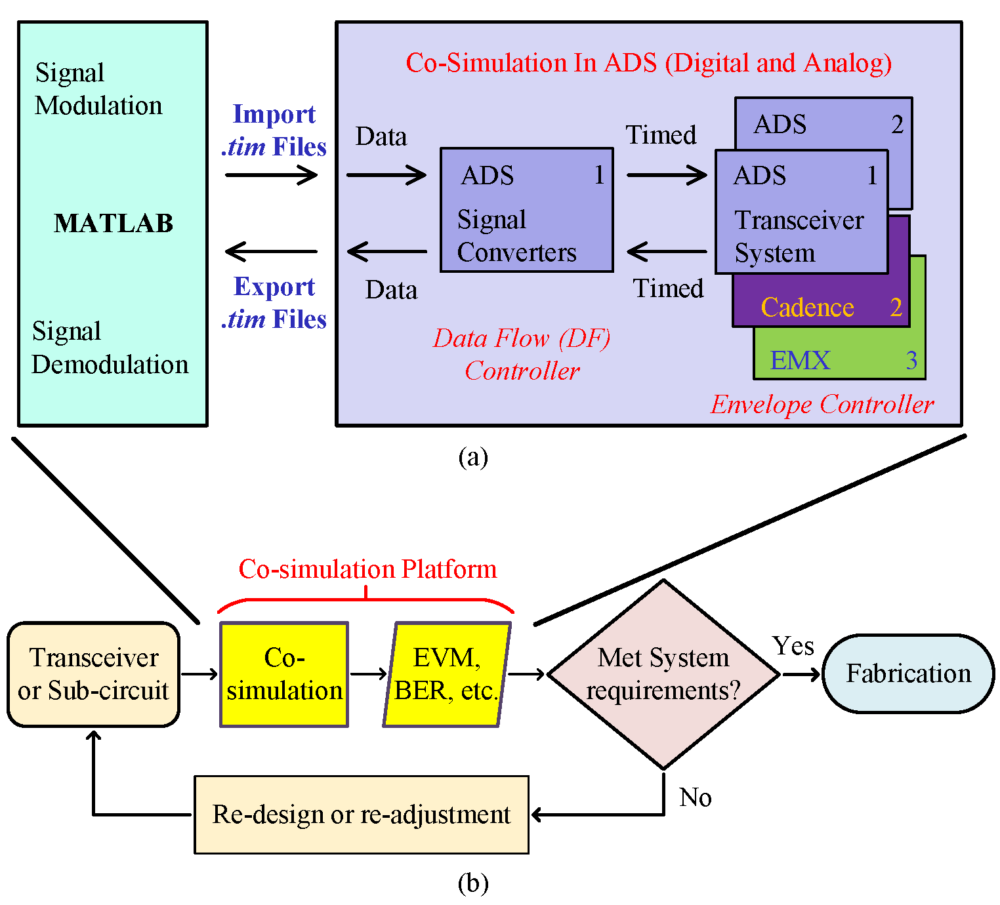

# HKUST-OWL-Co-simulation-Platform
Supervised by Professor C. Patrick Yue, We developed this co-simulation platform for high frequency RF and mm-Wave transceiver systems dealing with complex modulated signals

# 1. Motivation

Traditionally, a continuous-wave (CW) signal is used to evaluate and simulate RF and millimeter-wave (mm-wave) circuits during the design procedure, while fabricated circuits are measured by modulated signals in the test phase, because complex modulated signals are used in reality. It is almost impossible to use a CW signal to predict system performance, such as error vector magnitude (EVM), bit error rate (BER), etc., of RF and mm-wave circuits when dealing with complex modulated signals. This platform, combining Matlab, ADS, Cadence and EMX simulators, is used for RF and mm-Wave transceiver system dealing with complex modulated signals. MATLAB is used to simlulate the baseband part of the system. The signal with both single or multi subcarries can be generated by the MATLAB code with adjustable parameters. The generated signal can be transmitted to ADS or cadence as the input of the frontend circuit. Then the simulation result from ADS or cadence is returned to MATLAB again for decoding and demodulation. The constellation, signal spectrum and waveform in time domain from both transmitter and receiver can be obtained. And the PAPR, BER, EVM can be calculated automatically by the simulator. The structure and the usage of the simulator is shown below.

# 2. Enviroment Requirment
* MATLAB 2019b or newer version
* ADS2019 or newer version
* Cadence

# 3. How to use the Co-Simulation Platform
1. Download the all files. Put 'RF_OFDM', 'Matlab_ADS_Data' and 'Cosimulation_TRx_wrk' folders into the same loacation.

2. Open Matlab 2019a (or later). Go to ‘RF_OFDM’ folder, Select and run ‘App_Ver2.mlapp’. 

3. Check the interchange files path in "Top_receiver_gui.m" and "Top_transmitter_gui.m" are consistent with your downloaded location.

4. Run the "App_Ver2.mlapp" in the MATLAB then you can see the GUI of the Co-Simulation Platform. You can change the parameters of the generated signal such as the number of the subcarriers, modulation scheme and so on. 

 5. Then click "Signal Modulation" button. Wait for a second, the spectrum, constellation and waveform of the transmitted signal are shown in the window.
 

 6. Then open the ADS project. Check the interchange file location to confirm they are consistent with your downloaded location. Then run the ADS simulation.
 

 7. After the ADS simulation is completed. Back to the MATLAB GUI. Click "Singal Demodulation" button. Then the spectrum, constellation, waveform and the calculated parameters of the received signal is shown in the window.
 
 
 8. Now you can replace your own design to the example project for the Co-Simulation!
